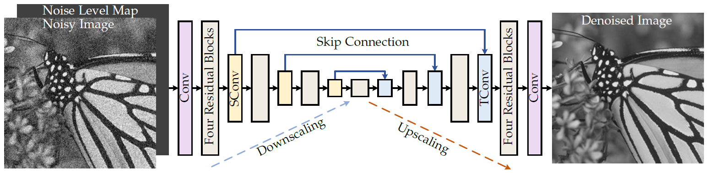
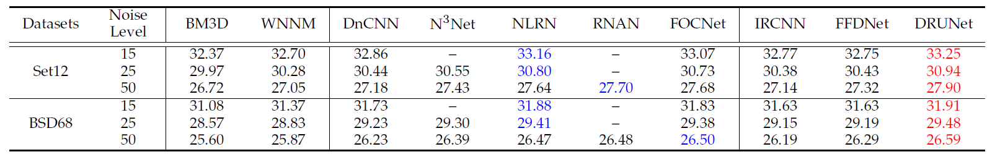
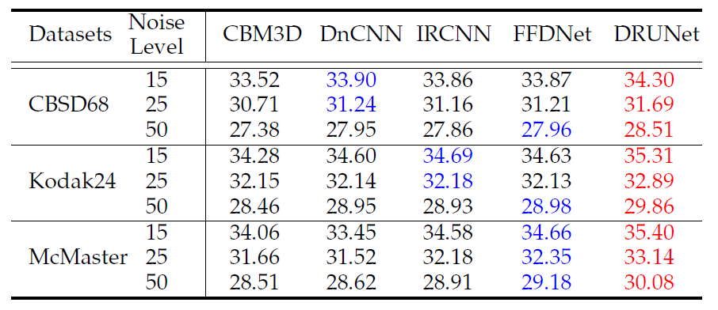
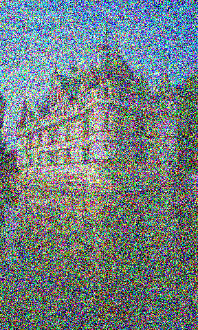
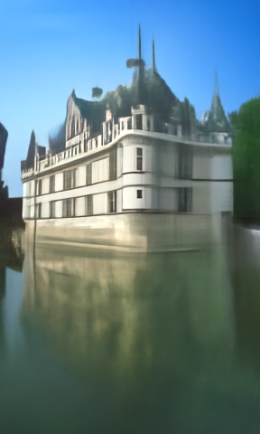
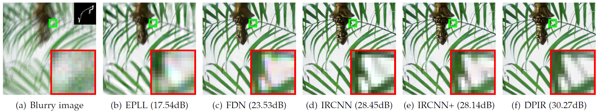
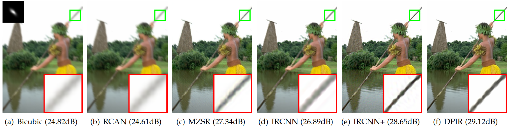
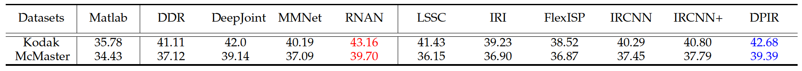
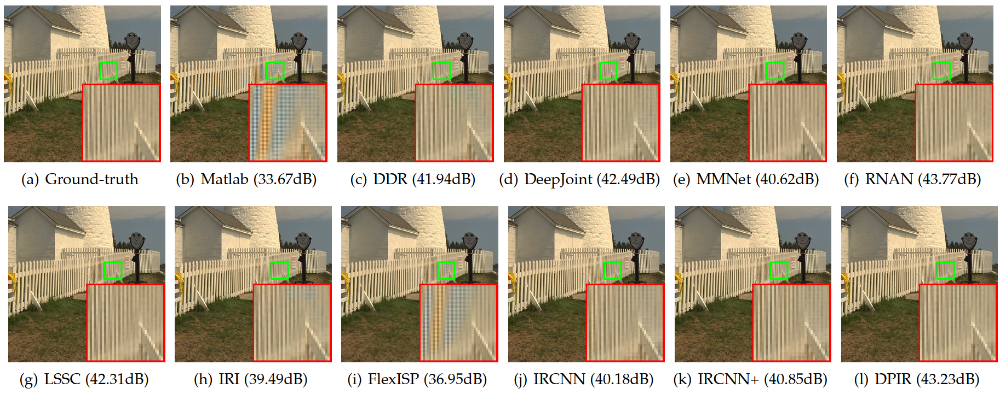

# Deep Plug-and-Play Image Restoration

 

[**Kai Zhang**](https://cszn.github.io/), Yawei Li, Wangmeng Zuo, Lei Zhang, Luc Van Gool, Radu Timofte

_[Computer Vision Lab](https://vision.ee.ethz.ch/the-institute.html), ETH Zurich, Switzerland_

[[paper arxiv](https://arxiv.org/pdf/2008.13751.pdf)]   [[paper tpami](https://ieeexplore.ieee.org/abstract/document/9454311)]


Denoising results on BSD68 and Urban100 datasets
----------
|  Dataset    | Noise Level | FFDNet-PSNR(RGB) | FFDNet-PSNR(Y) | **DRUNet-PSNR(RGB)** | **DRUNet-PSNR(Y)** |
|:---------:|:---------:|:---------:|:---------:|:---------:|:---------:|
| CBSD68 |  30    | 30.32  | 32.05  |  30.81 | 32.44 |
| CBSD68 |   50   | 27.97  | 29.65  |  28.51 | 30.09 |
| Urban100|  30   | 30.53  | 32.72  |  31.83 | 33.93 |
| Urban100|   50  | 28.05  | 30.09  |  29.61 | 31.57 |

```PSNR(Y) means the PSNR is calculated on the Y channel of YCbCr space.```


Abstract
----------
Recent works on plug-and-play image restoration have shown that a denoiser can implicitly serve as the image prior for
model-based methods to solve many inverse problems. Such a property induces considerable advantages for plug-and-play image
restoration (e.g., integrating the flexibility of model-based method and effectiveness of learning-based methods) when the denoiser is
discriminatively learned via deep convolutional neural network (CNN) with large modeling capacity. However, while deeper and larger
CNN models are rapidly gaining popularity, existing plug-and-play image restoration hinders its performance due to the lack of suitable
denoiser prior. In order to push the limits of plug-and-play image restoration, we set up a benchmark deep denoiser prior by training a
highly flexible and effective CNN denoiser. We then plug the deep denoiser prior as a modular part into a half quadratic splitting based
iterative algorithm to solve various image restoration problems. We, meanwhile, provide a thorough analysis of parameter setting,
intermediate results and empirical convergence to better understand the working mechanism. Experimental results on three
representative image restoration tasks, including deblurring, super-resolution and demosaicing, demonstrate that the proposed
plug-and-play image restoration with deep denoiser prior not only significantly outperforms other state-of-the-art model-based methods
but also achieves competitive or even superior performance against state-of-the-art learning-based methods.


The DRUNet Denoiser (state-of-the-art Gaussian denoising performance!)
----------
* Network architecture

   

* Grayscale image denoising

   

* Color image denoising

   
  
| |  |
|:---:|:---:|
|<i>(a) Noisy image with noise level 200</i>|<i>(b) Result by the proposed DRUNet denoiser</i>|

**Even trained on noise level range of [0, 50], DRUNet can still perform well on an extremely large unseen noise level of 200.**

Image Deblurring
----------
* Visual comparison

   


Single Image Super-Resolution
----------
* Visual comparison

   


Color Image Demosaicing
----------
* PSNR

   

* Visual comparison

   


Citation
----------
```BibTex
@article{zhang2021plug,
  title={Plug-and-Play Image Restoration with Deep Denoiser Prior},
  author={Zhang, Kai and Li, Yawei and Zuo, Wangmeng and Zhang, Lei and Van Gool, Luc and Timofte, Radu},
  journal={IEEE Transactions on Pattern Analysis and Machine Intelligence},
  volume={44},
  number={10},
  pages={6360-6376},
  year={2021}
}
 @inproceedings{zhang2017learning,
   title={Learning Deep CNN Denoiser Prior for Image Restoration},
   author={Zhang, Kai and Zuo, Wangmeng and Gu, Shuhang and Zhang, Lei},
   booktitle={IEEE Conference on Computer Vision and Pattern Recognition},
   pages={3929--3938},
   year={2017},
 }
```
